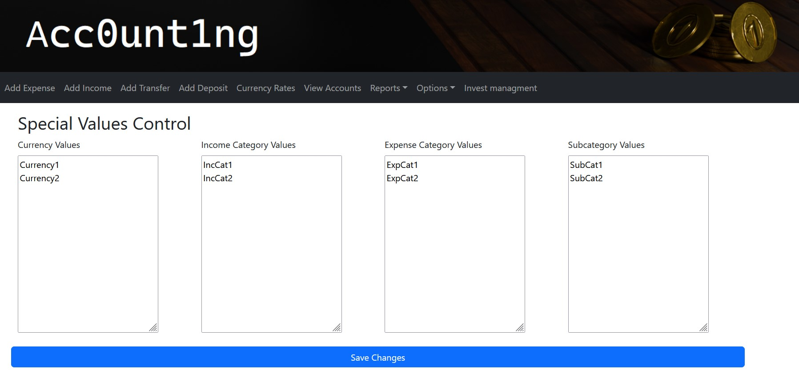
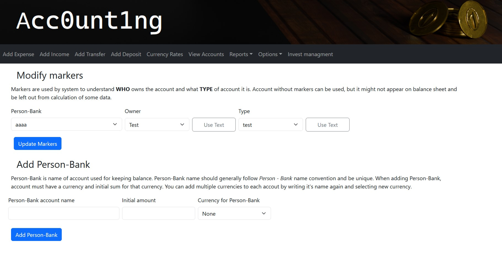

# Acc0unt1ng

A python based project for managing accounting.

## Getting started

### Requirements

* Docker
* Docker Compose

### Local version

Run Docker Compose file with `docker compose up`.

Proceed to open `http://localhost:80`

To stop application, simply use command `docker compose down`.

### Colab version

To use colab version go to "colab" branch of this repository.

## Initial setup requirements

First set-up will require you to initialize database and add SPVs (Special Values: currency/categories/sub-categories).  

There are 4 .csv files that need to be initialized/placed into the *db* folder of the project.

Each of them should have next structure:

Each currency/category/sub-category name is written on the new line
and the last row should **should not** be empty line, otherwise it would count as additional variable name.

If you would prefer to not create those files but let the app do it for you, it is possible to configure all of those csv's using *Database Options* in Web-interface.

Just write all SPVs you want in each row and click Save Changes.

## Account creation and marking

To create account, you will need to use *Accounts Options* to add record of desired account and then mark it with appropriate *type* and *owner* signals.

Page instructions will guide you to the expected format of the account record.

To clarify, all accounts in the Acc0unt1ng are called *person_bank* for easier understanding of ***"which account is whose?"***, but this is no hard requirement.

After creating *person_bank* record, it is recommended to mark it with *type* and *owner* signals.

For example, *person_bank* called "JohnDoe credit1", can be marked as "Credit" *type* to show that this is credit card account, and with "John" *owner* to show that owner of the account is John.
