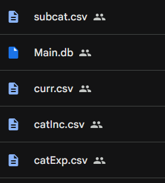
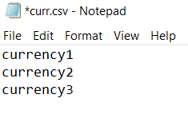
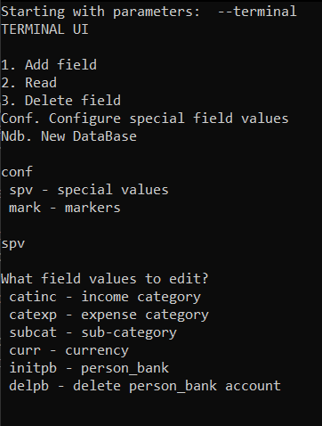
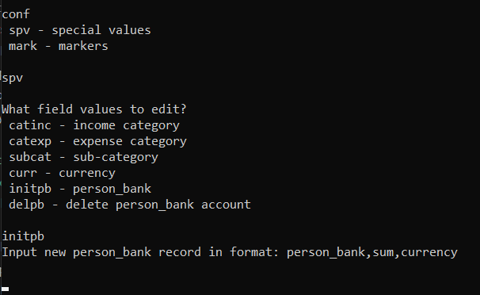

# Acc0unt1ng

A python based project for managing accounting.

## Getting started

Run notebook from 

Run Setup cell after acquiring cloud machine (always).

Paste your ngrok authtoken into "ngrok_authtoken" field and run webui. If you want notebook to remember that authtoken, after pasting it into the field, you will need to save that notebook as your own copy.

### Synchronizing DB changes over multiple users

To be able to modify DB from other accounts, you will need to run Acc0unt1ng at least once. That will make a **Acc0unt1ng** folder in your Google drive. Share entire folder with users you want to give access to. Then they should find that shared folder and add a shortcut to shared folder in the root of their's drive.

## Initial setup requirements

After installing requirements using Colab cell, you will need to add some parameters regarding currencies and categories for app to work (Only once).

There are 4 .csv files that need to be initialized/placed into the *Acc0unt1ng* folder on your drive.

Each of them should have next structure:

Each currency/category/sub-category name is written on the new line
and the last row should **should not** be empty line, otherwise it would count as additional variable name.

If you would prefer to not create those files but let the app do it for you, it is possible to configure all of those csv's using *Terminal UI* cell.

Under *Conf -> spv* menu you can select which values to edit.

## Account creation and marking

To create account, you will need to use either *TerminalUI* to add record of desired account and then mark it with appropriate *type* and *owner* signals, or using API requests when WebUI is running (WebUI can run even if no accounts were created).

### Using TerminalUI

Console instructions will guide you to the excpected format of the account record.

To clarify, all accounts in the Acc0unt1ng are called *person_bank* for easier understanding of ***"which account is whose?"***, but this is no hard requirement.

After creating *person_bank* record, it is needed to mark it with *type* and *owner* signals. Under *conf -> spv -> mark* menu, you can look over existing markings of *type* and *owner* and also modify them.

For example, *person_bank* called "JohnDoe credit1", can be marked as "Credit" *type* to show that this is credit card account, and with "John" *owner* to show that owner of the account is John.
